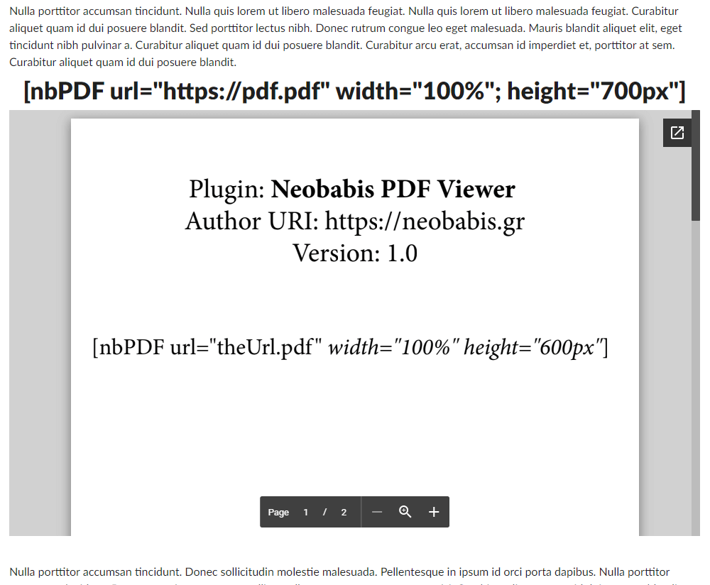

# Neobabis_Simple_WordPress_PDF_Viewer

Το πιο απλό και ελαφρύ plugin για ενσωμάτωση PDF στο WordPress.

Συμπιέζουμε (zip) τον φάκελο neobabis_pdf_viewer και το ανεβάζουμε ως plugin στο WordPress site μας.

#### Χρήση:
[nbPDF url="PdfUrl" width="100%" height="700px"]

Δες αναλυτικά το σχετικό άρθρο μου για περισσότερες λεπτομέρειες χρήσης: [WordPress Shortcode για PDF Viewer](https://neobabis.gr/wordpress-shortcode-για-pdf-viewer/)

